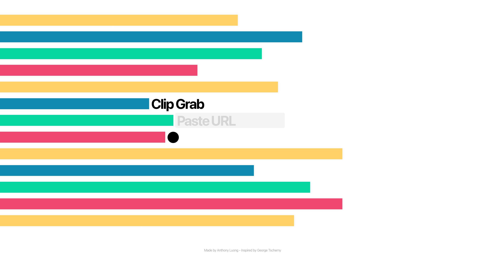

# Clip Grab

**[View Live Demo](https://clipgrabapp.vercel.app)** • **[Portfolio](https://anthonyluong.com)**

Clip Grab is a mobile-first video downloader for YouTube, TikTok, Instagram, and other supported platforms. It uses `yt-dlp` and `ffmpeg` for video extraction and processing, wrapped in a custom interface inspired by George Tscherny's 1972 *Servicio El Borincano de Pan Am* poster.

I built it as a simpler alternative to downloaders filled with rate limits, subscription prompts, popups, and unreliable redirects. It also became an experiment in using motion and haptic feedback as part of the interface itself.

---

## Features

- Download videos from supported platforms
- Process and merge media with `yt-dlp` and `ffmpeg`
- Mobile-first responsive interface
- Multi-stage motion and haptic feedback

---

## Running Locally

Install Node.js 18+, `yt-dlp`, and `ffmpeg`.

```bash
brew install yt-dlp ffmpeg
git clone https://github.com/Grasspunch/Clip-Grab.git
cd clip-grab
npm run install:all
npm run dev
```

---

## Credits

- Designed and built by [Anthony Luong](https://anthonyluong.com)
- Visual system inspired by George Tscherny's 1972 *Servicio El Borincano de Pan Am* poster

---

## License

MIT License © 2026 Anthony Luong
